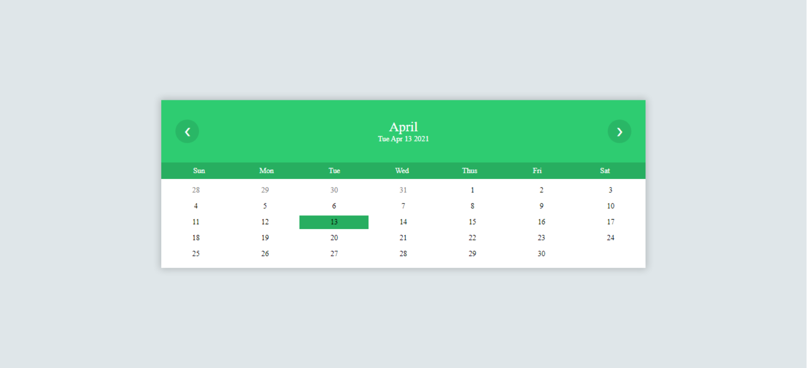

# Calender

_An calender widget to used at your website, and full source code files (HTML, CSS, and js file)._

---

#### Here you will find three files

---

- HTML file
- CSS file
- Javascript file
  

---

### Features

- It's a fully responsive calender.
- On top current date and day is display
  
- The current day is highlited with a different color
- You can also move to next, previous months and year by simply clicking buttons

---

### Hints for custom changes

- To change the width of calender change the calenderBody class, change width according to your required.

```
  calenderBody {
  width: 60%;
  margin: auto;
  }
```

- To Change background color of calender header, week days, and body modify months, weekends, and calenderBody respectively. According to your required color.

```
.months {
  background-color: #2ecc71;
}

.weekends {
  background-color: #27ae60;
}

.calenderBody {
  background-color: #fff;
}
```

- To modify current day color altr todays class.

```
.todays {
  background-color: #27ae60;
}

```
